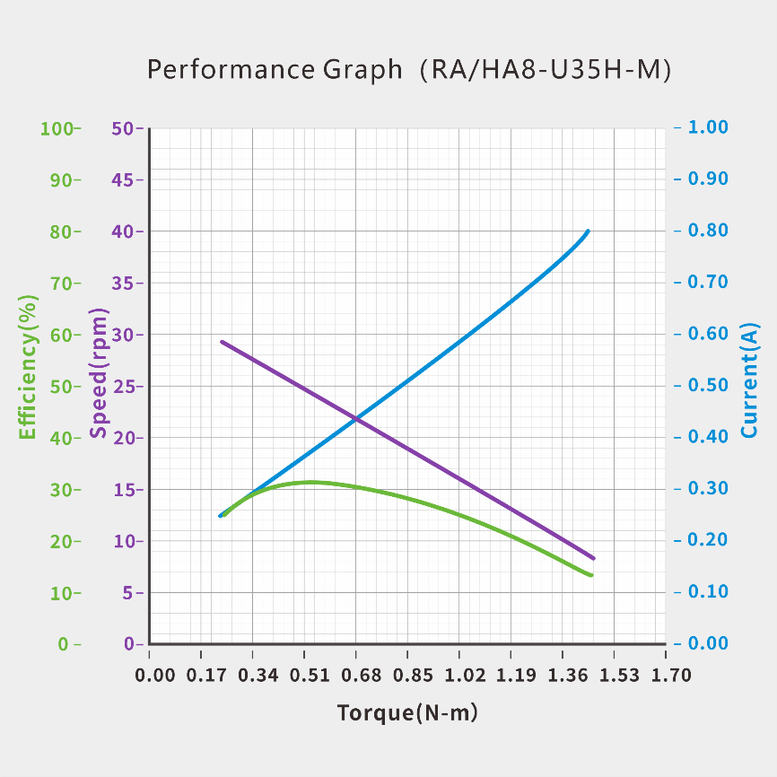

# UART Bus Servo 35KG Series 

## 1. Features

- Integrated design: brushed motor, reducer, 12‑bit magnetic absolute encoder, and controller

- UART/TTL half‑duplex protocol up to **1 Mbps**

- Resolution **4096 counts/360° (0.088°)**; min control step **0.1°**

- Control range: **±180°** (single‑turn) or **±368,640° / ±1024 turns** (multi‑turn)

- Power‑off position retention

- Trapezoidal accel/decel trajectory for smooth motion

- Auto power threshold detection with adaptive reduction

- Three stop modes: **Free / Lock / Damping**

- Five protections: **temperature / voltage / stall / power / current**

- PC configuration tool; firmware upgradable

  

## 2. Model definition

| Appearance      | R：Dual-shaft      | H：Single-shaft                    |                                  |
| --------------- | ------------------ | ---------------------------------- | -------------------------------- |
| Motor type      | X：Brushless       | P：Coreless                        | A/L：Cored                       |
| Dimension       | 6：31.5×21×27.6mm  | 8：40×40×20mm                      | 18：63×34×47mm                   |
| Protocols       | U：UART/TTL        | R：RS-485 P：PWM               | C：CAN  A：PWM(programmable) |
| Voltage         | [-]：7.4V          | H：12V                             | W：24V                           |
| Position Sensor | [-]：Potentiometer | M:12-bit magnetic absolute encoder |                                  |

**Models available for order**

- **RA8-U35(H)-M|HA8-U35(H)-M**

  

## 3. Specifications

### 3.1 Basic Specifications

| Item | Specification |
| --- | --- |
| Input Voltage | 6.0-8.4V \| 9.0–12.6 V |
| Motor Type | Iron motor |
| Position Sensor | 12‑bit magnetic absolute encoder |
| Effective Position Range | ±180° (single‑turn); ±368,640° (multi‑turn) |
| Resolution | 2048/360° (0.176°) |
| Processor | 32‑bit MCU |
| Protocol | UART/TTL half‑duplex |
| Baud Rate | 9,600 bps–1 Mbps |
| ID Range | 0–254 |
| Reduction Ratio | 378:1 |
| Output Spline | Copper/ Ø6mm / 25T |
| Gear Material | All-metal copper-aluminum composite gear material |
| Interface | PH2.0-3Pin |
| Case Material | Aluminum alloy middle frame with upper/lower engineering plastic housings |
| Dimensions (W×H×D) | 40×20×40 mm |
| Weight | 53 g |
| Operating Temp. | ‑10–60 °C |
| Operating Modes | Single-turn Position Control Mode Multi-turn Position Control Mode Damping Mode |

### 3.2 Characteristics

| Item | **Specifications（7.4V\|12V）** |
| --- | --- |
| Max Stall Torque | 3.43 N·m (35 kg·cm) |
| Max Continuous Torque | 1.27 N·m (13 kg·cm) |
| Rated Torque | 0.54 N·m (5.5 kg·cm) |
| Rated Speed | 16 rpm (0.625 sec@60°) |
| No‑load Speed | 34 rpm (0.298 sec@60°) |
| No‑load Current | <200 mA |
| Standby Current | <20 mA |
| Peak Current | 3 A |
| Axial Load | 20 N |
| Radial Load | 40 N |

### 3.3 Performance Graph

### 3.4 Overload Graph

## 4. Drawings and Installation Instructions

### 4.1 CAD Dimensional Drawing

|  |
| :----------------------------------------------------------: |

### 4.2 Interface Definition

|  |
| :----------------------------------------------------------: |

### 4.3 Wiring Diagram 

- **Series Connection**  

|  |
| :----------------------------------------------------------: |

- **Parallel Connection**

|  |
| :----------------------------------------------------------: |

### 4.4 Installation Instruction

- **Single-shaft**

|  |
| :----------------------------------------------------------: |

-  **Dual-shaft**

  |  |
  | :----------------------------------------------------------: |

  

## 5. Development & Compatibility

​	The bus servo series adopts a unified hardware platform and system architecture, fully addressing the needs for diversity and flexibility. Different models are seamlessly compatible with each other, uniformly supporting standard protocols and control commands, significantly simplifying system integration and development processes.
​	To accelerate the deployment of the project, we provide a reliable SDK (Software Development Kit) that includes code samples, drivers and detailed technical documents. The SDK supports multiple mainstream development environments and programming languages. Please refer to the table below to get more information.

## 6. Protections

- All protection parameters can be set and modified by our PC configuration tool.

- The status flag bits are defined as follows: 1 represents Protection triggered，0 represents normal operation.

  |  |
  | ------------------------------------------ |

  > [!WARNING]
  >
  > Modification towards any protection parameters may cause
  >
  > damage to the production or affect its normal operation. Please proceed with caution and ensure potential risks are fully assessed before making changes.

### 6.1 Temperature Protection
-  Temperature protection parameter can be set via our PC configuration tool. If the temperature exceeds the threshold, temperature protection will be triggered. 
-  Default value: 70℃.
-  When the temperature protection is triggered, the servo will automatically switch to low-power mode while maintaining basic motion functions. 
-  Check temperature protection bit [bit7] to verify if temperature protection mode is on.
-  When the temperature drops 10°C below the preset protection threshold, the servo will resume normal operation, and the temperature protection bit will be reset to 0.

### 6.2 Voltage Protection
-  High/low voltage protection parameters can be set via our PC configuration tool. If the voltage exceeds the threshold, voltage protection will be triggered.

-  Default values are as follows， 

  - 7.4V version：6.0-8.4V

  - 12V version：9.0-12.6V

  - 24V version：20-25V

- When voltage protection is triggered, the servo will automatically switch to free mode.

- Check voltage protection bit [bit3]/[bit4] to verify if the voltage protection mode is on.

- When the operating voltage is restored to the normal range after rebooted, the servo will resume normal operation.

### 6.3 Stall Protection
- Turn on stall and lock protection；
- Preset the parameter of power protection value. If the value exceeds the threshold, stall protection will be triggered.
- When stall protection is triggered, the servo will automatically switch to free mode.
- Please check stall protection bit [bit2] to verify if the stall protection mode is on.
- When stop command is sent, the servo will resume normal operation.

### 6.4 Power Protection
- Turn off stall and lock protection；
- Preset the parameter of stall power upper limit, which serves as the reference operating power after power protection is triggered.
- Preset the parameter of power protection value. If the value exceeds the threshold, power protection will be triggered.
- When power protection is triggered, the servo will automatically reduce the power to upper limit and keep operating.
- Please check power protection bit [bit6] to verify if the power protection mode is on.

### 6.5 Current Protection
- Preset the current protection parameter. If the value exceeds the threshold, current protection will be triggered.
- When current protection is triggered, the servo will automatically switch to free mode.
- Check current protection bit [bit5] to verify if the current protection mode is on.
- When the operating current is lower than current protection value, the servo will resume normal operation.
- This parameter can be used in conjunction with stall protection or power protection, serving as a safeguard when neither of the two is triggered.

## 7. Control & Modes

### 7.1 Control Instruction

| ID   | Instruction Name (Updated)                                | Description                                                  |
| ---- | --------------------------------------------------------- | ------------------------------------------------------------ |
| 01   | **Ping**                                                  | Instruction that checks if the servo with the unique ID is online |
| 08   | **Single-Turn Position Control (Basic)**                  | Instruction to set motion time and execution power           |
| 11   | **Single-Turn Position Control (Advanced – Time-based)**  | Instruction to set motion time, acceleration/deceleration time and execution power |
| 12   | **Single-Turn Position Control (Advanced – Speed-based)** | Instruction to set motion velocity, acceleration/deceleration time and execution power |
| 10   | **Read Single-Turn Current Position**                     | Instruction to read position within ±180°                    |
| 13   | **Multi-Turn Position Control (Basic)**                   | Instruction to set motion time and execution power           |
| 14   | **Multi-Turn Position Control (Advanced – Time-based)**   | Instruction to set motion time, acceleration/deceleration time and execution power |
| 15   | **Multi-Turn Position Control (Advanced – Speed-based)**  | Instruction to set motion velocity, acceleration/deceleration time and execution power |
| 16   | **Read Multi-Turn Current Position**                      | Instruction to read position within ±368,640°                |
| 17   | **Reset Loop**                                            |                                                              |
| 09   | **Damping Control**                                       |                                                              |
| 24   | **Stop Instructions**                                     | Instruction that chooses to enter locked, unlocked, or damping status after stopping |
| 25   | **Synchronous Instruction**                               |                                                              |
| 18   | **Asynchronous Write Instruction**                        |                                                              |
| 19   | **Asynchronous Activate Instruction**                     |                                                              |
| 02   | **Reset Factory Configuration**                           | Instruction that restores to its initial factory default settings |
| 03   | **Read Data**                                             | Instruction to read individual parameter and operating status data |
| 04   | **Customize Configuration Parameters**                    | Instruction to write individual servo parameters             |
| 22   | **Data Monitor**                                          | Instruction to batch read operating status data              |
| 23   | **Set Origin Point**                                      | Instruction to set the current position as the origin (0°)   |

> [!NOTE]
>
> The superscript number after the description (such as 04]) is the instruction index mark, corresponding to the chapter number of the "Instruction Document

### 7.2 Communication Format 

- **Transmit Packet Format**

  | Bytes   | 0~1                                  | 2                  | 3                  | 4~N+3        | N+4      |
  | ------- | ------------------------------------ | ------------------ | ------------------ | ------------ | -------- |
  | Content | Request header indicator `0x12 0x4C` | Instruction number | Content length `N` | Data content | Checksum |

Example: ID2 takes 500ms to rotate to 90 degrees at maximum power

|  |
| ------------------------------------------------------ |

-  **Response Packet Format**

  | Bytes   | 0~1                                  | 2                  | 3                  | 4~N+3        | N+4      |
  | ------- | ------------------------------------ | ------------------ | ------------------ | ------------ | -------- |
  | Content | Respond header indicator `0x05 0x1C` | Instruction number | Content length `N` | Data content | Checksum |

Respond: `0x05 0x1c 0x0a 0x03 0x00 0x86 0x03 0xb7`

Unpacking: 0x86 0x03 is the position. After unpacking, it becomes 902. Converted to the position system, it is 90.2 degrees

Example: Read the position of ID0

|  |
| ---------------------------------------------------- |

### 7.3 Instruction Interval Suggestion

- The product supports multiple control instructions, and the length of different instructions may be different. To avoid control exceptions caused by packet loss, it is recommended to add at least 10ms to the interval after the instruction is completed.
- Example: Instruction 1（Completed）→ Delay 10ms → Instruction 2（Completed）→ Delay 10ms → Instruction 3.

### 7.4 New Instruction Priority

- Under default settings, if it receives a new control instruction during the execution of the current instruction, it will immediately interrupt the current instruction and prioritize the execution of the new instruction. The original instruction will not continue to be executed.

### 7.5 Communication Detection

- Send Ping instructions of corresponding ID to get the status packet, so as to check if the servo is in normal operation. 

### 7.6 Single-Turn Position Control

- **Control Range**

  In Single-Turn position Mode, the control range is ±180°.

- **Control Unit**

  The unit of all position control is degree(°), and the min control accuracy is 0.1°.

- **Control Instruction**

  The product offers various control instructions, allowing customers to flexibly configure parameters such as motion speed, time, and operating power based on application needs. It also supports trapezoidal acceleration/deceleration smooth curve control, enabling customized acceleration/deceleration intervals for smoother and more stable motion characteristics.

| Instruction                                               | Parameter                                                    |
| --------------------------------------------------------- | ------------------------------------------------------------ |
| Single-Turn Position Control (Basic) [8]                  | Target position, time, operating power                       |
| Single-Turn Position Control (Advanced - Time-based)[11]  | Target position, time, acceleration time, deceleration time, operating power |
| Single-Turn Position Control (Advanced - Speed-based)[12] | Target position, motion velocity, acceleration time, deceleration time, operating power |

|  |
| :----------------------------------------------------------: |

- **Position Read**

​       Send a multi-turn position read instruction to the servo with the specified ID to receive the data of current position.

### 7.7 Multi-Turn Position Control

- **Control Range**

  In Multi-Turn position Mode, the control range is ±368,640°（±1,024 turns）

- **Control Unit**

  The unit of all position control is degree(°), and the min control accuracy is 0.1°.

- **Control Instruction**

  The product offers various control instructions, allowing customers to flexibly configure parameters such as motion speed, time, and operating power based on application needs. It also supports trapezoidal acceleration/deceleration smooth curve control, enabling customized acceleration/deceleration intervals for smoother and more stable motion characteristics.

  | Instruction                                              | Parameter                                                    |
  | -------------------------------------------------------- | ------------------------------------------------------------ |
  | Multi-Turn Position Control (Basic) [13]                 | Target position, time, operating power                       |
  | Multi-Turn Position Control (Advanced - Time-based) [14] | Target position, time, acceleration time, deceleration time, operating power |
  | Multi-Turn Position Control (Advanced - Speed-based)[15] | Target position, motion velocity, acceleration time, deceleration time, operating power |

|  |
| :----------------------------------------------------------: |

- **Multi-turn Position Read**

  Send a multi-turn position read instruction to the servo with the specified ID to receive the data of current position.

- **Multi-turn Position Reset** 

  When the servo is in free mode , the current position data can be reset through our exclusive software or a designated instruction.

  After resetting, the servo will reset the position based on its current absolute position, and the initial value of the position will be in the range of -180° to +180° again.

For example: as shown in the figure, the current position at point A1 is 6,880°, and position will be θ1 after resetting. The current position at point A2 is 6,800°, and position will be -θ2 after resetting.

|  |
| :----------------------------------------------------------: |

- **Power-off Position Retention**

  Our product supports power-off position retention function.

  After power-off, if the servo 's position has not changed, the current position value after power-on will remain unchanged.

  For example: The position value of point A is 6,800° before power-off. If the position does not change during power-off and the remains at point A, the position value after power-on will still be 6,800°. 

  After power-off, if the servo's position is moved externally, the post-power-on position will remain within ±180° of the retained position.

  For example: As shown in the figure, the position value of point A is 6,800° before power-off. If the is rotated by an external force during power-off and stops at point B1, the position value after power-on will be 6,920°; if it stops at point B2, the position value will be 6,680°.	

|  |
| :----------------------------------------------------------: |

### 7.8 Damping Mode[9]

- The servo is allowed to adjust to different positions under external force while maintaining a certain damping effect. 
-  The damping coefficient can be customized.

### 7.9 Stop Instructions[24]

- Customers can choose the appropriate stop instruction type based on different motion control needs. The specific types detailed in the table below. 
- Stop instruction can also be used to restore normal operation of a servo under stall protection.
- When the servo is in free mode, sending a "Lock Mode" instruction can re-establish locking force from its current position.

| Type         | Description                                                  |
| ------------ | ------------------------------------------------------------ |
| Free Mode    | The servo stops moving immediately and releases the locking force. |
| Lock Mode    | The servo stops moving immediately and holds the locking force, or restores the locking force in the non‑locking state. |
| Damping Mode | The servo stops moving immediately and enters damping mode, and the position can be adjusted by external force. |

### 7.10 Synchronous Instruction[25]

- A single instruction contains the control instructions of multiple servos at the same time, which is suitable for the scenario of multiple servos working together.
- Each servo matches the parameters in the instruction content through a unique ID, and only parses and responds to the control information related to its own ID.
- After receiving the instruction, all servo s will start to execute their respective instructions at the same time to achieve the effect of synchronous action.

### 7.11 Asynchronous Instruction[18] [19]

- The asynchronous instruction consists of two parts: the asynchronous write instruction and the asynchronous execution instruction. 
- After sending the asynchronous write instruction, the motion instruction to be executed is sent and temporarily stored in the register of the corresponding ID servo . This motion instruction is not executed immediately—it requires a separate asynchronous execution instruction to trigger execution uniformly.
- When the asynchronous execution instruction is sent, all servo s with stored motion instructions will execute their corresponding actions simultaneously, achieving synchronized control of multiple servo s. 
- The stored motion instruction will remain intact unless overwritten by a new instruction or power is disconnected. It will not be overwritten or cleared by the execution of other instructions.
- After the asynchronous instruction is triggered for execution, the related parameters are automatically cleared and no longer retained.

### 7.12 Customize Configuration Parameters

- The parameters of servo in the table below all support single read[03], write[04], and reset[02].
- It is recommended to use our PC configuration tool for setting.

> [!WARNING]
>
> Any modification in parameters may damage the product or affect its normal operation. Please proceed with caution and ensure potential risks are fully assessed before making changes.

| Number | Parameter Name                    | Write | Read | Unit | Parameter      |
| ------ | --------------------------------- | :---: | :--: | ---- | -------------- |
| 33     | Instruction Response Switch       |   ●   |  ●   |      | Default: Off   |
| 34     | Servo ID                          |   ●   |  ●   |      | 0~254          |
| 36     | Baud Rate Option                  |   ●   |  ●   |      | 9,600bps~1Mbps |
| 37     | Stall Protection Switch           |   ●   |  ●   |      |                |
| 38     | Upper Limit of Stall Power        |       |  ●   | mW   |                |
| 39     | Lower Limit of Protection Voltage |   ●   |  ●   | mV   |                |
| 40     | Upper Limit of Protection Voltage |   ●   |  ●   | mV   |                |
| 41     | Protection Temperature            |   ●   |  ●   | ADC  |                |
| 42     | Power Protection Value            |   ●   |  ●   | mW   |                |
| 43     | Current Protection Value          |   ●   |  ●   | mA   |                |
| 46     | Power‑on Mode Switch              |   ●   |  ●   |      | Default: Off   |
| 48     | Position Limit Switch             |   ●   |  ●   |      | Default: Off   |
| 49     | Power‑on Slow Start Switch        |   ●   |  ●   |      | Default: Off   |
| 50     | Power‑on Slow Start Time          |   ●   |  ●   | ms   |                |
| 51     | Upper Limit of Position           |   ●   |  ●   | 0.1° |                |
| 52     | Lower Limit of Position           |   ●   |  ●   | 0.1° |                |

### 7.13 Read Data

- **Single Read**[03]

​	The working status data in the table below can be read separately through the single read instruction.

| Parameter Number | Parameter Name                | Unit |
| ---------------- | ----------------------------- | ---- |
| 01               | Present Operating Voltage     | mV   |
| 02               | Present Operating Current     | mA   |
| 03               | Present Operating Power       | mW   |
| 04               | Present Operating Temperature | ADC  |
| 05               | Servo Status                  |      |
| 06               | Servo Model                   |      |
| 07               | Firmware Version              |      |

- **Batch Read**[22]

​	The working status data in the table below can be read in batches through data monitor instruction.

| Byte Number | Parameter Name                | Unit |
| ----------- | ----------------------------- | ---- |
| [04]        | Servo ID                      |      |
| [5, 6]      | Present Operating Voltage     | mV   |
| [7, 8]      | Present Operating Current     | mA   |
| [9, 10]     | Present Operating Power       | mW   |
| [11, 12]    | Present Operating Temperature | ADC  |
| [13]        | Servo Status                  |      |
| [14, 17]    | Present Position              | 0.1° |
| [18, 19]    | Present Number of Turns       |      |

- **Servo Status**

|  |
| :---------------------------------------------------------: |

### 7.14 Set Origin Point[23]

​	When the servo is in free mode, the current position can be set to be original position(0°) through our exclusive software or a designated instruction, facilitating zero calibration after assembly and providing a reference starting position for subsequent motions.