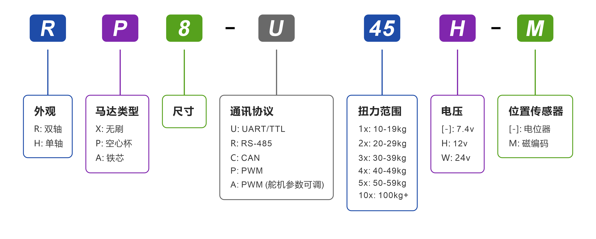

# HA8/RA8-U25-M
---

## 1. 型号定义

## 2. 规格参数
### 2.1. 基础参数

<table>
  <tr>
    <th width="200" align="left">参数项目</th>
    <th width="400" align="left">技术规格</th>
  </tr>
  <tr>
    <td>工作电压</td>
    <td>9.0 ～ 12.6 V</td>
  </tr>
  <tr>
    <td>马达类型</td>
    <td>空心杯马达</td>
  </tr>
  <tr>
    <td>位置传感器</td>
    <td>12-bit 非接触式绝对值磁编码器</td>
  </tr>
  <tr>
    <td>分辨率</td>
    <td>4096 阶 / 360°（0.088°）</td>
  </tr>
  <tr>
    <td>有效角度</td>
    <td>±180°（单圈） / ±368,640°（多圈）</td>
  </tr>
  <tr>
    <td>处理器</td>
    <td>32-bit MCU</td>
  </tr>
  <tr>
    <td>通信类型</td>
    <td>UART / TTL 半双工</td>
  </tr>
  <tr>
    <td>波特率</td>
    <td>9,600 bps ～ 1 Mbps</td>
  </tr>
  <tr>
    <td>ID 范围</td>
    <td>0 ～ 254</td>
  </tr>
  <tr>
    <td>减速比</td>
    <td>273 : 1</td>
  </tr>
  <tr>
    <td>齿轮材料</td>
    <td>全金属不锈钢组合</td>
  </tr>
  <tr>
    <td>输出轴规格</td>
    <td>不锈钢 / Ø6 mm / 25T</td>
  </tr>
  <tr>
    <td>外壳材料</td>
    <td>铝合金中段 / 上下壳工程塑胶</td>
  </tr>
  <tr>
    <td>接口类型</td>
    <td>PH2.0 – 3Pin</td>
  </tr>
  <tr>
    <td>尺寸重量</td>
    <td>40 × 20 × 40 mm / 73 g</td>
  </tr>
  <tr>
    <td>工作温度</td>
    <td>-10 ～ 60 ℃</td>
  </tr>
  <tr>
    <td>工作模式</td>
    <td>单圈角度&emsp;|&emsp;多圈角度&emsp;|&emsp;阻尼模式</td>
  </tr>
</table>

### 2.2. 特性参数 (@12V)

<table>
  <tr>
    <th width="200" align="left">参数项目</th>
    <th width="400" align="left">规格内容</th>
  </tr>
  <tr>
    <td>最大静态扭矩（堵转）</td>
    <td>4.41 N·m（45 kg·cm）</td>
  </tr>
  <tr>
    <td>最大动态扭矩</td>
    <td>1.67 N·m（17 kg·cm）</td>
  </tr>
  <tr>
    <td>额定扭矩</td>
    <td>0.54 N·m（5.5 kg·cm）</td>
  </tr>
  <tr>
    <td>额定转速</td>
    <td>64 rpm（0.156 s / 60°）</td>
  </tr>
  <tr>
    <td>空载转速</td>
    <td>90 rpm（0.110 s / 60°）</td>
  </tr>
  <tr>
    <td>峰值电流</td>
    <td>6 A</td>
  </tr>
  <tr>
    <td>空载电流</td>
    <td>＜300 mA</td>
  </tr>
  <tr>
    <td>静态电流</td>
    <td>＜30 mA</td>
  </tr>
  <tr>
    <td>轴向</td>
    <td>20 N</td>
  </tr>
   <tr>
    <td>径向</td>
    <td>40 N</td>
  </tr>

</table>

  
  

    T-N 特性曲线
  

  
  

    机械过载曲线
  

## 3. 外观尺寸与安装

  
  

    单轴安装说明
  

  
  

    双轴安装说明
  

## 4. 接口与连线

  
  

    串联
  

  
  

    并联
  

## 5. 软件与开发支持
### 5.1. 开发支持

通过多平台软件开发工具包（SDK），可将 Fashion Star 舵机无缝集成至各类控制系统与应用项目中。

* **Arduino 平台**：支持 Arduino Uno、Mega2560、ESP32 以及 STM32（Arduino Core）。
* **STM32 标准开发环境**：提供适用于 [STM32F103](sdk/stm32f103.md) 与 [STM32F407](sdk/stm32f407.md) 的原生 SDK。
* **高级编程语言支持**：
    * [Python SDK](sdk/python.md)（桌面端 / 嵌入式）
    * [C++ SDK](sdk/cpp.md)
    * [C# SDK](sdk/csharp.md)
* **嵌入式与机器人框架**：MicroPython 与 ROS 集成支持。

### 5.2. 控制指令

> **建议**：完整封包格式与字段定义请参考 `docs/uart-servo/protocols/uart-rs485-protocol.md`。  
> **指令间隔**：建议 5–10 ms。

| 指令 ID | 指令名称 | 回应类型 |
| :---: | :----------------------------------------- | :---: |
| 01 (0x01) | [通讯检测<wbr>（Ping）](../protocols/uart-rs485-protocol.md#5-ping) | 固定 |
| 08 (0x08) | [简易单圈角度控制](../protocols/uart-rs485-protocol.md#6-single-turn-position-control-basic) | 可选 |
| 11 (0x0B) | [高级单圈角度控制<wbr>（基于时间）](../protocols/uart-rs485-protocol.md#7-single-turn-position-control-advanced-time-based) | 可选 |
| 12 (0x0C) | [高级单圈角度控制<wbr>（基于速度）](../protocols/uart-rs485-protocol.md#8-single-turn-position-control-advanced-speed-based) | 可选 |
| 10 (0x0A) | [单圈角度读取](../protocols/uart-rs485-protocol.md#9-read-single-turn-current-position) | 固定 |
| 13 (0x0D) | [简易多圈角度控制](../protocols/uart-rs485-protocol.md#10-multi-turn-position-control-basic) | 可选 |
| 14 (0x0E) | [高级多圈角度控制<wbr>（基于时间）](../protocols/uart-rs485-protocol.md#11-multi-turn-position-control-advanced-time-based) | 可选 |
| 15 (0x0F) | [高级多圈角度控制<wbr>（基于速度）](../protocols/uart-rs485-protocol.md#12-multi-turn-position-control-advanced-speed-based) | 可选 |
| 16 (0x10) | [多圈角度读取](../protocols/uart-rs485-protocol.md#13-read-multi-turn-current-position) | 固定 |
| 17 (0x11) | [清除当前圈数<wbr>（Reset Loop）](../protocols/uart-rs485-protocol.md#15-reset-loop) | 可选 |
| 09 (0x09) | [阻尼模式](../protocols/uart-rs485-protocol.md#16-damping-control) | 可选 |
| 24 (0x18) | [停止指令](../protocols/uart-rs485-protocol.md#14-stop-instructions) | 可选 |
| 25 (0x19) | [同步指令](../protocols/uart-rs485-protocol.md#18-synchronous-instruction) | 无 |
| 18 (0x12) | [异步写入指令](../protocols/uart-rs485-protocol.md#19-asynchronous-write-instruction) | 可选 |
| 19 (0x13) | [异步执行指令](../protocols/uart-rs485-protocol.md#20-asynchronous-activate-instruction) | 无 |
| 03 (0x03) | [参数与状态数据读取](../protocols/uart-rs485-protocol.md#21-read-data) | 固定 |
| 22 (0x16) | [数据监控](../protocols/uart-rs485-protocol.md#22-data-monitor) | 固定 |
| 04 (0x04) | [自定义参数写入](../protocols/uart-rs485-protocol.md#23-customize-configuration-parameters) | 可选 |
| 23 (0x17) | [原点设置](../protocols/uart-rs485-protocol.md#17-set-origin-point) | 可选 |

> **回应类型说明**：  
> **固定**＝一定回传；**可选**＝是否回传取决于 PC 端设置“动作后回应”；**无**＝不回传。

## 6. 保护功能

| 保护类型 | 触发条件 | 保护动作 | 恢复机制 | 状态标志位 |
| :--- | :--- | :--- | :--- | :--- |
| **温度保护** | 当前温度 > 设定阈值 (默认 70℃) | **强制低功率运行** 限制出力，维持基础运动 | 温度降至 (设定值 - 10℃) 时 **自动恢复** | `[bit7]` |
| **电压保护** | 电压超出高/低压 设定范围 | **自动释放锁力** 无力矩输出，进入自由状态 | **必须重新上电** 且电压恢复至正常区间 | `[bit3]/[bit4]` |
| **堵转保护** | 堵转失锁开启 且功率 > 保护阈值 | **自动释放锁力** 防止电机长时间过载烧毁 | 无需断电，发送 **停止指令** 即可恢复运行 | `[bit2]` |
| **功率保护** | 堵转失锁关闭 且功率 > 保护阈值 | **限制运行功率** 降至“堵转功率上限”运行 | 功率负载回落后 **自动恢复** | `[bit6]` |
| **电流保护** | 实时电流 > 设定阈值 | **自动释放锁力** 作为末端安全冗余保障 | 电流回落至阈值以下 **自动恢复** | `[bit5]` |

> **注1：电压版本默认保护区间**
> * **7.4V 版本**: 6.0V - 8.4V
> * **12V 版本**: 9.0V - 12.6V
> * **24V 版本**: 20.0V - 25.2V
>
> **注2：应用策略**
> 电流保护可与堵转/功率保护结合使用，当上位机未触发前两项逻辑时，电流保护作为硬件层级的最后保障。

## 7. 转接板
