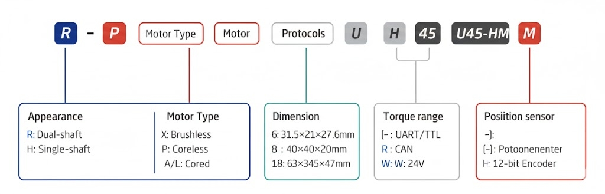
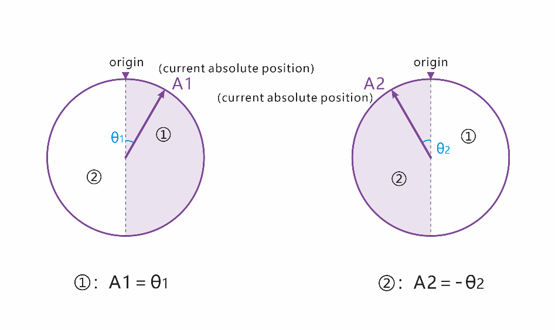

# HA8/RA8-U25-M
---

## 1. 型号定义

| Appearance | Motor Type | Dimension | Protocols | Voltage | Position Sensor |
| :--- | :--- | :--- | :--- | :--- | :--- |
| **R**: Dual-shaft | **X**: Brushless | **6**: 31.5×21×27.6mm | **U**: UART/TTL | **[-]**: 7.4V | **[-]**: Potentiometer |
| **H**: Single-shaft | **P**: Coreless | **8**: 40×40×20mm | **R**: RS-485 | **H**: 12V | **M**: 12-bit Encoder |
| | **A/L**: Cored | **18**: 63×34×47mm | **C**: CAN | **W**: 24V | |

**Models available for order**
- **RA8-U25(H)-M|HA8-U25(H)-M**

## 3. Specifications

### 3.1 Basic Specifications
| Item | Specification |
| :--- | :--- |
| Input Voltage | 6.0-8.4V \| 9.0–12.6 V |
| Resolution | 2048/360° (0.176°) |
| Baud Rate | 9,600 bps–1 Mbps |
| Gear Material | All-metal copper-aluminum composite |

### 3.2 Characteristics
| Item | **Specifications（7.4V\|12V）** |
| :--- | :--- |
| Max Stall Torque | 2.54 N·m (25 kg·cm) |
| Max Continuous Torque | 0.88 N·m (9 kg·cm) |
| No‑load Speed | 51 rpm (0.198 sec@60°) |
| Peak Current | 3 A |

### 3.3 Performance Graph

### 3.4 Overload Graph

## 4. Drawings and Installation Instructions

### 4.1 CAD Dimensional Drawing

### 4.2 Interface Definition

### 4.3 Wiring Diagram 
- **Series Connection**

- **Parallel Connection**

### 4.4 Installation Instruction
- **Single-shaft**

- **Dual-shaft**

## 5. Development & Compatibility
The bus servo series adopts a unified hardware platform.

## 6. Protections
- All protection parameters can be set and modified by our PC configuration tool.
- The status flag bits are defined as follows: 1 represents Protection triggered，0 represents normal operation.

> [!WARNING]
> Modification towards any protection parameters may cause damage to the production.

## 7. Control & Modes

### 7.2 Communication Format 
- **Transmit Packet Format**

- **Response Packet Format**

### 7.6 Single-Turn Position Control

### 7.7 Multi-Turn Position Control
- **Multi-turn Position Reset** 

- **Power-off Position Retention**

## 8. Configuration Parameters
| Number | Parameter Name | Write | Unit | Default |
| :---: | :--- | :---: | :---: | :--- |
| 34 | Servo ID | ● | - | 1 |
| 36 | Baud Rate | ● | bps | 1Mbps |
| 41 | Protection Temp | ● | ADC | 70°C |

### 8.1 Read Data

