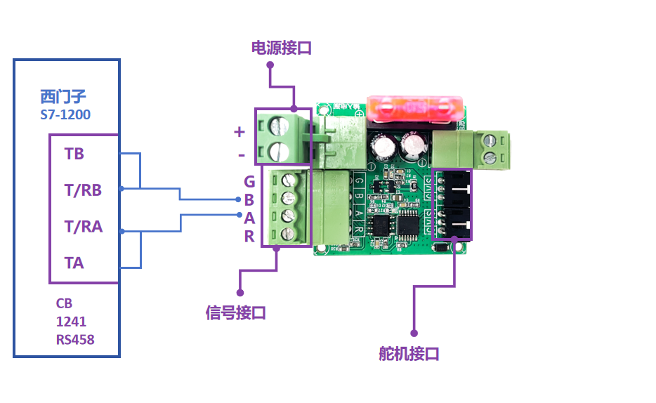
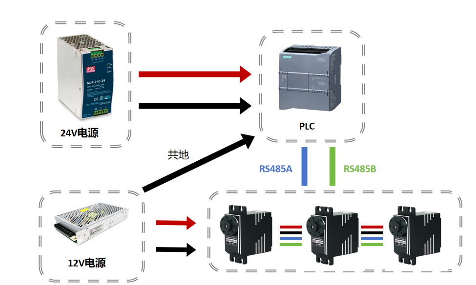
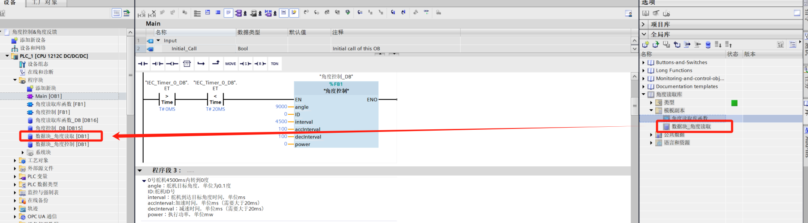

# **西门子博途V19平台使用说明（例程PLC：S7-1200）**

## 一、接线说明

### 1.机柜接线说明

### 2.PLC-UC04-UART舵机接线说明

| **CB 1241_TA**   | **CB 1241_T/RA** |
| ---------------- | ---------------- |
| **CB 1241_TB**   | **CB 1241_T/RB** |
| **CB 1241_T/RA** | **UC04_A**       |
| **CB 1241_T/RB** | **UC04_B**       |

### 3.RS485舵机接线说明

| **PLC-A**                  | **RS485舵机-A** |
| -------------------------- | --------------- |
| **PLC-B**                  | **RS485舵机-B** |
| **电源+**                  | **RS485舵机+**  |
| **电源-（需要和PLC共地）** | **RS485舵机-**  |

## 二、程序说明

### **1.组态配置（软件为：博途V19）**

①在设备组态中添加PLC型号，将CB 1241(RS485)通信板加入组态中

②鼠标左键双击PLC设备，选择''系统和时钟存储器''，勾选''启用系统存储器字节''和''启用时钟存储器字节''

### **2.库函数调用及使用**

①点击软件右侧“库”，打开‘’全局库‘’，选择.al19尾缀的文件打开

②打开后可以看到已经添加入其中，在模板副本中拖动FB函数（库函数）到程序中并填写好参数，将数据块拖动到最左侧程序块中

③单击数据块，将数据块中的发送数据拖动到发送指令Send_P2P中的BUFFER中

④单击数据块，将数据块中的接收数据拖动到接收指令Receive_P2P中的BUFFER中

### **3.参数说明（库函数通用）**

- angle：舵机目标角度，单位为0.1度
- ID：舵机ID号
- interval：舵机到达目标角度时间，单位ms
- accInterval：加速时间，单位ms（需要大于20ms）
- decInterval：减速时间，单位ms（需要大于20ms）
- power：执行功率，单位mw
