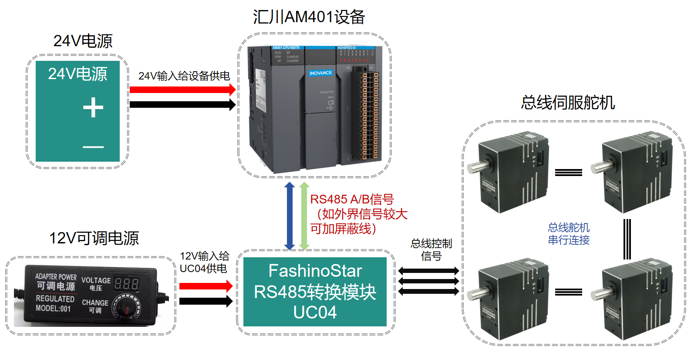
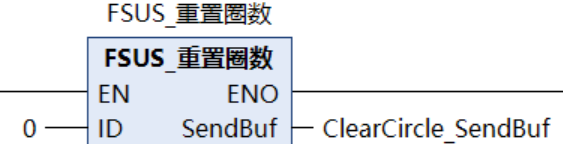
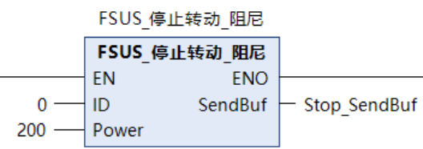

# InoproShop平台--使用说明（例程PLC：AM401）

## 一、接线说明

### 1、舵机接线说明

### 2、RS485舵机接线说明

### 3、UC04接线说明

 

## 二、程序说明

### 1、PLC串口与串口自由协议的配置

（1）、串口配置，默认为：

​	①、波特率：115200

​	②、奇偶校验：无

​	③、数据位：8

​	④、停止位：1&nbsp;

（2）、自由协议（例）：&nbsp;

​	①、接收字节数寄存器：%MW0/%MB0

​	②、接收数据起始地址：%MW1/%MB2

​	③、最大接收长度：256

​	④、发送字节数寄存器：%MW300/%MB600

​	⑤、发送数据起始地址：%MW301/%MB602

​	⑥、最大发送长度：256

### 2、串口数据写入（通过库函数进行操作）：

  ①、0 ------- 舵机ID号

  ②、3600 -- 舵机目标角度360.0度

  ③、3000 -- 在3000ms(3S)转到目标角度

  ④、100 ---- 加速时间100ms

  ⑤、100 ---- 减速时间100ms

通过库函数将数据转换并封装进数据发送数组(自定义)

然后将SendBuf中的数据按顺序赋值给串口数据发送起始地址。

### 3、串口数据发送

将协议数据包写入到串口发送寄存器完毕后，将发送字节数寄存器写入要发送的字节长度（即非零）即可发送成功，操作成功后该寄存器自动归零。

说明：串口配置可参考下面文档

[中型PLC编程手册（软件使用篇）-CN-C02.PDF](https://newweb.inovance.com/owfile/ProdDoc/SC/PS00003145_PDF_CN/C02/%E4%B8%AD%E5%9E%8BPLC%E7%BC%96%E7%A8%8B%E6%89%8B%E5%86%8C%EF%BC%88%E8%BD%AF%E4%BB%B6%E4%BD%BF%E7%94%A8%E7%AF%87%EF%BC%89-CN-C02.PDF?response-content-disposition=inline;filename=)

### 4、库函数与通信协议的说明

说明：Fashionstar 伺服总线舵机通讯协参考：

*https://wiki.fashionrobo.com/uartbasic/uart_rs485_protocols/*

## 三、库文件的导入

①在”Inoproshop”工具中找到工程标签并且点击导入PLCCopenXML将所有的FB库导入到工程文件中。

②导入成功后，我们通过拖拽工具箱中的功能块来进行我们的库文件调用并且填入我们实际所需的参数。

## 四、库函数说明

### 1、**角度控制**&nbsp;

  ①、ID：舵机ID编号

  ②、Angle：舵机目标角度（3600）

  ③、Interval：舵机到达目标角度时间

  ④、AccInterval：加速时间

  ⑤、DecInterval：减速时间

  ⑥、Power：执行功率

**说明：在将SendBuf数据写入到串口发送寄存器的时候需要按顺序且连续发送，而且发送的时候字节数大小也要更改为需要发送的字节数！**

&nbsp;

### 2、**角度读取**&nbsp;

  ①、ID：舵机ID编号

&nbsp;

### 3、**重置圈数**&nbsp;

  ①、ID：舵机ID编号

&nbsp;

### 4、**原点设置**&nbsp;

  ①、ID：舵机ID编号

&nbsp;

### 5、**阻尼模式**&nbsp;

  ①、ID：舵机ID编号

  ②、Power：阻尼执行功率(mv)

### 6、**通讯检测**&nbsp;

  ①、ID：舵机ID编号

### 7、**异步指令**

- 开始异步：固定指令，直接使用。

- 结束异步：

​       State：0 -- 异步结束立即执行，1 -- 异步结束取消执行

### 8、**数据监控**&nbsp;

  ①、ID：舵机ID编号

### 9、**停止转动（三种：卸力、锁力、阻尼）**&nbsp;

  ①、ID：舵机ID编号

  ②、Power：执行功率(mv)

