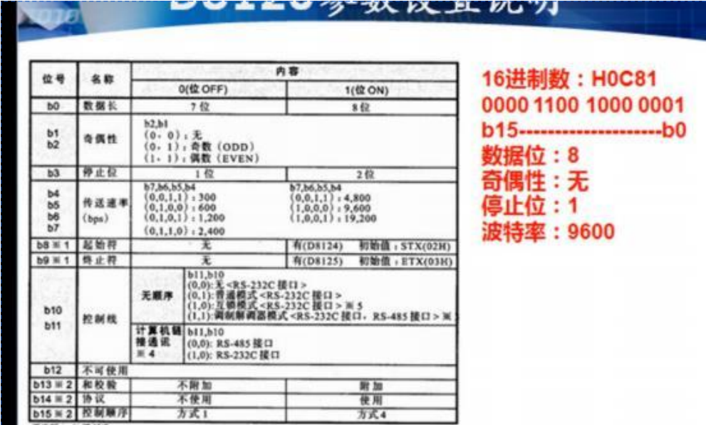
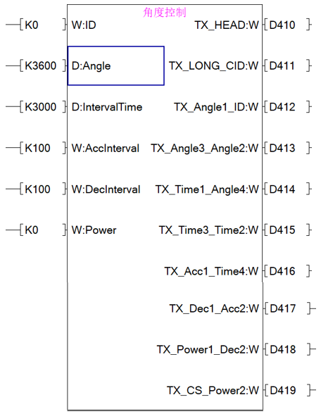
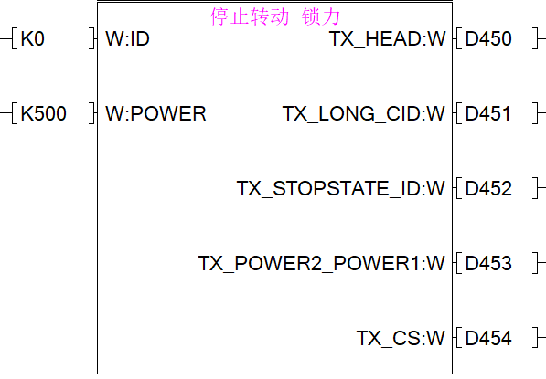

# GX-WORK2平台--使用说明（例程PLC：FX3U）

# 一、接线说明

## 1、设备接线架构

## 2、UC04接线说明

# 二、程序说明

### 1、PLC 串囗参数设置：

  ①、数据位：8

  ②、奇偶性：无

  ③、停止位：1

  ④、波特率：9600

  (因为这款 PLC无115200 波特率，所以需要在上位机设置舵机波特率为 9600)

### 2、串口数据写入（通过库函数进行操作）：

  ①、K0 ------ 舵机ID号

  ②、K3600 -- 舵机目标角度360.0度

  ③、K3000 -- 在3000ms(3s)转到目标角度

  ④、K100 --- 加速时间100ms

  ⑤、K100 --- 减速时间100ms

通过库函数将以上数据转换并存入一个连续的寄存器内如下图所示，存入D410、D411以此类推

### 3、串口通讯指令

  ①、发送的数据存在D410

  ②、发送的数据个数为20个

  ③、返回的数据存在D200

  ④、返回的数据个数最大为7个

### 4、串口数据发送请求

### 5、串口复位

**说明：串口配置学习可参考：**

[(018)三菱FX3U PLC和串口助手通讯的方法_哔哩哔哩_bilibili](https://www.bilibili.com/video/BV1d84y1a7su/?spm_id_from=333.337.search-card.all.click&vd_source=1f8eb3ac14fcef7ab654bb2f9fbaab75)

### 6、库函数与通信协议的说明：

**说明：Fashionstar伺服总线舵机通讯协参考：**

<https://wiki.fashionrobo.com/uartbasic/uart_rs485_protocols/>

①、以上面设置0号舵机3000ms旋转到360度为例子，用MOV指令分别将第二和第一位两两分别存入寄存器D410中，其他以此类推

# 三、库文件导入

①在“GX WORK2”工具中，找到工程--\>库操作--\>在工程中获取库。然后打开“在工程中获取库”。

②将自己所需的库文件导入到工程中即可

③通过拖拽FB管理者的FB库文件即可调用，然后写入自己实际所需的控制参数即可。

# 四、**库函数说明**

## 1、角度控制

- ID:舵机ID号

- Angle:目标角度（K3600则是360.0度为目标角度）

- IntervalTime:转到目标角度的时间间隔（K3000为3000ms）

- AccInterval:加速时间（K100为100ms）

- DecInterval:减速时间（K100为100ms）

- Power:执行功率

  **说明：从D410开始需要到结束需要连续的寄存器写入，不可断层!**

  **（不一定是以D410作为数据起点，自定，以下同理）**

  

## 2、角度读取

- ID:舵机ID号

  

## 3、零点设置

- ID:舵机ID号

  

## 4、数据监控

- ID:舵机ID号

  

## 5、停止转动--三种模式

- ID:舵机ID号

- Power:执行功率

  

  
  
  

## 6、通讯检测

- ID:舵机ID号

  

## 7、异步指令

- 开始异步指令--固定指令，所以STATE不起作用的，给K0即可

- 结束异步指令

1.  K0，结束后立即执行

2.  K1，结束后取消执行

    

## 8、重置多圈

- ID:舵机ID号

  

## 9、阻尼模式

- ID:舵机ID号

- POWER：阻尼功率

  
