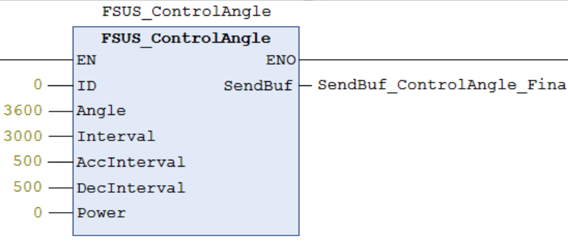
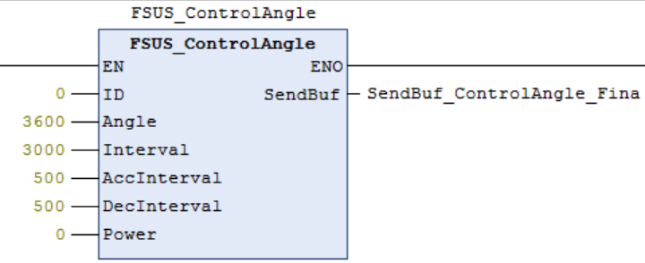
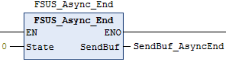

# CodeSys平台--使用说明（例程PLC：GCAN302）

## 一、接线说明

### 1、舵机接线说明

### 2、RS485舵机接线说明

### 3、UC04接线说明

## 二、程序说明

### 1、PLC串口添加

### 2、串口初始化（根据实际情况的PLC控制器进行指令块的更改）

### 3、串口数据写入（通过库函数进行操作）

1)  0 ------- 舵机ID号

2)  3600 -- 舵机目标角度360.0度

3)  3000 -- 在3000ms(3S)转到目标角度

4)  500 ---- 加速时间500ms

5)  500 ---- 减速时间500ms

    通过库函数将数据转换并封装进数据发送数组(自定义)

    

### 4、串口数据发送（根据实际情况的PLC控制器进行指令块的更改）

1)  Port：端口号

2)  TxData：发送数组

3)  TxSize：发送数组的长度，即协议数据包的字节长度

    

### 5、串口数据接收（根据实际情况的PLC控制器进行指令块的更改）

1)  Port：端口号

2)  RxData：接收数组

3)  MaxSize：接收数组的长度，即协议回复数据包的字节长度

    

### 6、库函数与通信协议的说明

说明：Fashionstar 伺服总线舵机通讯协参考：

*https://wiki.fashionrobo.com/uartbasic/uart_rs485_protocols/*

## 三、库文件的导入

① 在”Codesys”工具中找到库管理器，点击库存储，接着进行FB库的安装。

② 安装成功后，我们将刚刚安装的FB进行添加。

③ 添加成功后，我们就可以对库我呢见进行调用。

## 四、库函数说明

### 1、**角度控制**&nbsp;

①、ID：舵机ID编号

②、Angle：舵机目标角度（3600 = 360.0°）

③、Interval：舵机到达目标角度时间（3000 = 3S）

④、AccInterval：加速时间

⑤、DecInterval：减速时间

⑥、Power：执行功率

说明：在串口发送的时候需要更改对应指令的数据字节长度

&nbsp;

### 2、*角度读取*&nbsp;

①、ID：舵机ID编号

&nbsp;

### 3、**重置圈数**&nbsp;

①、ID：舵机ID编号

&nbsp;

### 4、**原点设置**&nbsp;

①、ID：舵机ID编号

&nbsp;

### 5、**阻尼模式**&nbsp;

①、ID：舵机ID编号

②、Power：阻尼执行功率(mv)

&nbsp;

### 6、**通讯检测**&nbsp;

①、ID：舵机ID编号

&nbsp;

### 7、**异步指令**

①、开始异步：固定指令，直接使用。

②、结束异步：

​    State：0 -- 异步结束立即执行，1 -- 异步结束取消执行

&nbsp;

### 8、数据监控&nbsp;

①、ID：舵机ID编号

&nbsp;

### 9、**停止转动（三种：卸力、锁力、阻尼）**&nbsp;

①、ID：舵机ID编号

②、Power：执行功率(mv)

