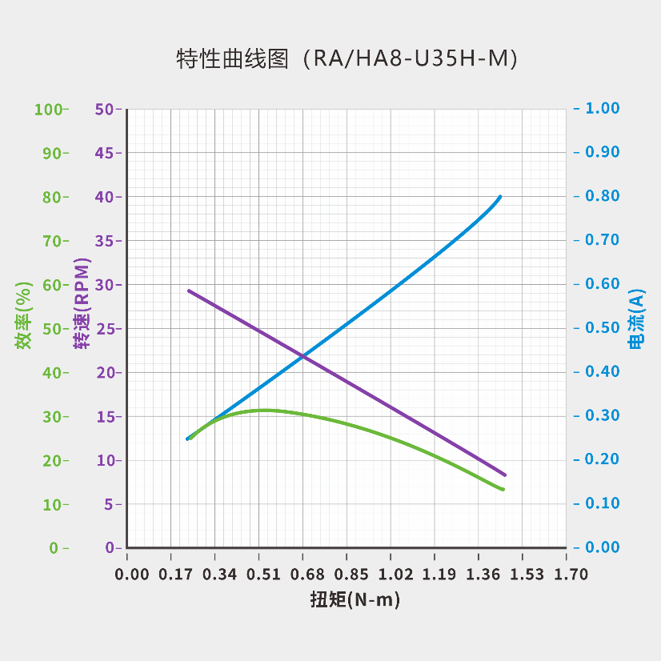
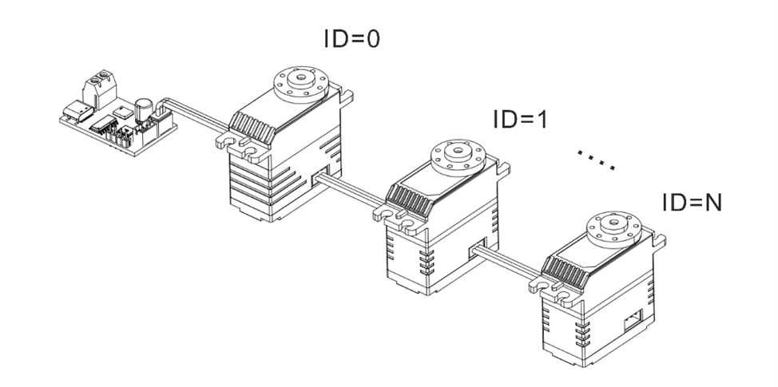

# UART总线伺服舵机35KG系列

<!--start:version_intro-->

> **版本：** V1.2.04

<!--end:version_intro-->

## 产品特点

- 有刷电机、减速器、位置编码器与控制器一体化设计
- UART 通讯协议，波特率最高支持 1 Mbps
- 12-bit 绝对值位置编码器，支持任意角度设定为原点
- 支持 ±368,640° 范围内任意角度控制
- 具备断电角度记忆功能，断电后角度数据可保持
- 内置梯形加减速控制算法，实现平滑动作曲线
- 自动检测功率阈值，运行中智能降至安全功率
- 三种停止模式：锁力保持、失锁释放、阻尼控制
- 集成温度、电压、堵转、功率、电流五重保护机制
- 提供可视化上位机调试工具，支持固件升级

<!--start:product_intro-->

## 型号定义

| 外观    | 马达类型  | 尺寸              | 通讯协议               | 电压      | 位置传感器                    |
| ------- | --------- | ----------------- | ---------------------- | --------- | ----------------------------- |
| R: 双轴 | X: 无刷   | 6: 31.5×21×27.6mm | U: UART/TTL            | [-]: 7.4V | [-]: 电位器                   |
| H: 单轴 | P: 空心杯 | 8: 40×20×40mm     | S: 分布式串行总线      | H: 12V    | M: 绝对值位置编码器（磁编码） |
|         | A/L: 铁芯 | 18: 63×34×47mm    | R: RS-485              | W: 24V    |                               |
|         |           |                   | A: PWM（舵机参数可调） |           |                               |
|         |           |                   | C: CAN                 |           |                               |
|         |           |                   | P: PWM                 |           |                               |

<!--end:product_intro-->

**订购型号**

- **RA8-U35(H)-M|HA8-U35(H)-M**

## 产品参数

### 基本参数

| 参 数                    | 规 格                                |
| ------------------------ | ------------------------------------ |
| **工作电压**             | 6.0-8.4v                             |
| **马达类型**             | 铁芯马达                             |
| **位置传感器**           | 12bit 非接触式绝对值编码器（磁编码） |
| **有效角度（行程范围）** | ±180°（单圈角度）                    |
| **分辨率**               | 2048 阶/360°（0.176°）               |
| **处理器**               | 32bit MCU                            |
| **通信类型**             | UART/TTL 半双工                      |
| **波特率**               | 9,600bps~1Mbps                       |
| **ID 范围**              | 0~254                                |
| **减速比**               | 378:1                                |
| **输出齿规格**           | 铝 / Ø6mm / 25T                      |
| **齿轮材料**             | 全金属铜铝组合                       |
| **接口类型**             | PH2.0-3Pin                           |
| **外壳材料**             | 铝合金中段/上下壳工程塑胶            |
| **尺寸**                 | 40×20×40mm                           |
| **重量**                 | 53g                                  |
| **工作温度**             | -10~60℃                              |
| **工作模式**             | 单圈角度                             |

### 特性参数

| 参数                 | 规格（7.4v \|12v)     |
| -------------------- | --------------------- |
| 最大静态扭矩（堵转） | 3.43N·m (35kg-cm)     |
| 最大动态扭矩         | 1.27N·m  (13kg-cm)    |
| 额定扭矩             | 0.54N·m (5.5kg-cm)    |
| 额定转速             | 16rpm（0.625sec@60°） |
| 空载转速             | 34rpm（0.298sec@60°） |
| 空载电流             | ＜200mA               |
| 待机电流             | ＜30mA                |
| 峰值电流             | 3A                    |
| 轴向负载             | 20N                   |
| 径向负载             | 40N                   |

### 特性曲线

### 过载曲线

<!--start:CAD_intro-->

## 图纸及安装说明

### 尺寸图

### 接口定义

### 连线说明 
**串联**

**并联**

### 安装说明

- **单轴**

  

- **双轴**

<!--end:CAD_intro-->

## 开发与兼容性

总线伺服舵机系列采用统一的硬件平台与系统架构，全面兼顾多样化与灵活性需求。不

同型号间可无缝兼容，统一支持标准协议与控制指令，显著简化系统集成与开发流程。

为加速项目部署，我们提供完整的 SDK（软件开发工具包），内含丰富示例代码、驱动

程序与详细技术文档，支持多种主流开发环境与编程语言。具体支持信息详见下表。

欢迎访问官方网站 www.fashionrobo.com 获取更多技术资料。

## 保护功能

- 所有保护参数都可以通过上位机设定修改。
- 状态标志位定义如下：1为进入保护，0为工作正常。

> [!WARNING]
> 任何参数的修改都可能对产品造成损害或影响其正常运行。请谨慎操作，并在更改前确保已充分评估可能的风险。

### 温度保护

- 通过上位机设定`温度保护`参数，超出范围将触发温度保护。
- 出厂默认保护温度为70℃。
- 温度保护被触发时，伺服舵机自动切换至低功率维持基础运动功能。
- 可以通过查询对应的舵机状态标志位[bit7]，来判断是否进入温度保护。
- 当温度低至所设定保护温度值10℃的时候，伺服舵机将再次自动恢复正常功率工作，同时，相应标志位重新被置0。

### 电压保护

- 通过上位机设定`高压保护`和`低压保护`参数，超出范围将触发电压保护；

- 出厂默认工作电压如下， 

  -7.4v版本：6.0-8.4v

  -12v 版本：9.0-12.6v

  -24v 版本：20.0-25.2v

- 电压保护被触发时，伺服舵机会自动释放锁力；

- 可以通过查询对应的舵机状态标志位[bit3]/ [bit4]，来判断是否进入电压保护。

- **必须要再次上电，且工作电压在正常范围内，**才能使伺服舵机恢复工作。

### 堵转保护

- 设定`堵转失锁保护`为开。
- 设定`功率保护值`参数，超出范围将触发堵转保护。
- 堵转保护被触发时，伺服舵机会自动释放锁力。
- 可以通过查询对应的舵机状态标志位[bit2]，来判断是否进入堵转保护。
- 无需断电，通过发送停止指令，即可恢复正常运行。

### 功率保护

- 设定`堵转失锁保护`为关。
- 设定`堵转功率上限`参数，此参数为功率保护触发后的参考运行功率；
- 设定`功率保护值`参数，超出范围将触发功率保护。
- 功率保护被触发时，伺服舵机会自动降低功率，至堵转功率上限参数值运行。
- 可以通过查询对应的舵机状态标志位[bit6]，来判断是否进入功率保护。

### 电流保护

- 设定`电流保护`参数，超出范围将触发电流保护。
- 电流保护被触发时，伺服舵机会自动释放锁力。
- 可以通过查询对应的舵机状态标志位[bit5]，来判断是否进入电流保护。
- 当工作电流低于电流保护值，伺服舵机自动恢复工作；
- 此参数可以结合堵转或功率保护使用，作为前两者均未触发的时候的保障。

## 指令功能

### 控制指令

| 指令ID | 指令名称                    | 功能描述                                 |
| ------ | --------------------------- | ---------------------------------------- |
| 01     | 通讯检测                    | 检查指定 ID 间伺服舵机是否在线           |
| 08     | 简易单圈角度控制            | 运动时间、执行功率可设置                 |
| 11     | 高级单圈角度控制 (基于时间) | 运动时间、加减速时间、执行功率可设置     |
| 12     | 高级单圈角度控制 (基于速度) | 运动速度、加减速时间、执行功率可设置     |
| 10     | 单圈角度读取                | ±180°范围内                              |
| 13     | 简易多圈角度控制            | 运动时间、执行功率可设置                 |
| 14     | 高级多圈角度控制 (基于时间) | 运动时间、加减速时间、执行功率可设置     |
| 15     | 高级多圈角度控制 (基于速度) | 运动速度、加减速时间、执行功率可设置     |
| 16     | 多圈角度读取                | ±368,640°范围内                          |
| 17     | 清除当前圈数                |                                          |
| 09     | 阻尼模式                    |                                          |
| 24     | 停止指令                    | 停止后可选择进入锁定、失锁、阻尼三种状态 |
| 25     | 同步指令                    |                                          |
| 18     | 异步写入指令                |                                          |
| 19     | 异步执行指令                |                                          |
| 02     | 自定义参数重置              | 恢复到出厂默认参数设置                   |
| 03     | 参数&状态数据读取           | 单个读取参数和工作状态数据               |
| 04     | 自定义参数写入              | 单个写入舵机参数                         |
| 22     | 数据监控                    | 批量读取工作状态数据                     |
| 23     | 原点设置                    | 设置当前角度位置为原点（0°）             |

### 协议格式

-  **发送协议格式**

| **字节位** | **0~1**                   | **2**    | **3**     | **4~N+3** | **N+4** |
| ---------- | ------------------------- | -------- | --------- | --------- | ------- |
| 内容       | 请求头标识   0x12 0x4c | 指令编号 | 内容长度N | 数据内容  | 校验和  |

示例：ID2舵机 以最大功率，500ms时间旋转到90度的位置

- **响应协议格式**

| **字节位** | **0~1**                   | **2**    | **3**     | **4~N+3** | **N+4** |
| ---------- | ------------------------- | -------- | --------- | --------- | ------- |
| 内容       | 响应头标识   0x05 0x1c | 指令编号 | 内容长度N | 数据内容  | 校验和  |

*解包：0x86 0x03是当前的舵机角度，解包后是902，转换为角度制就是90.2度。*

### 指令间隔建议

- 产品支持多种控制指令，不同指令长度可能存在差异。为避免因指令丢包导致控制异常，**建议在指令发送完成后再增加至少 10ms 的间隔时间**。

  例如：指令1（发送完成）→ 延迟10ms → 指令2（发送完成）→ 延迟10ms → 指令3

### 指令中断执行

- 在默认设置下，当前指令执行过程中，若伺服舵机收到新的控制指令，将立即中断当前指令并优先执行新指令。原指令将不再继续执行。

### 通讯检测[01]

- 通过发送对应ID的Ping指令，根据回包情况判断该舵机是否在线。

### 单圈角度控制

**控制范围**:单圈角度模式下，控制范围为±180°。

**控制单位**:所有的角度控制均以度(°)为单位，最小控制精度0.1°。

**控制指令**:产品提供多种控制指令，客户可根据应用需求灵活配置运动速度、时间、运行功率等参数。同时支持梯形加减速平滑曲线控制功能，可根据需要自定义加减速区间，以获取更平滑稳定的运动特性。

| **指令类型**                      | **参数**                                         |
| --------------------------------- | ------------------------------------------------ |
| 简易单圈角度控制[8]               | 目标角度、运动时间、运行功率                     |
| 高级单圈角度控制  (基于时间) [11] | 目标角度、运动时间、加速时间、减速时间、运行功率 |
| 高级单圈角度控制  (基于速度) [12] | 目标角度、运动速度、加速时间、减速时间、运行功率 |

**角度回读**[10]:向指定ID的伺服舵机发送单圈角度读取指令，可以收到当前位置的角度数据。

### 多圈角度控制

**控制范围**:多圈角度模式下，控制范围为±368,640°（±1,024圈）。

**控制单位**:所有的角度控制均以度(°)为单位，最小控制精度0.1°。

**控制指令**:产品提供多种控制指令，客户可根据应用需求灵活配置运动速度、时间、运行功率等参数。同时支持梯形加减速平滑曲线控制功能，可根据需要自定义加减速区间，以获取更平滑稳定的运动特性。

| **指令类型**                      | **参数**                                         |
| --------------------------------- | ------------------------------------------------ |
| 简易多圈角度控制[13]              | 目标角度、运动时间、运行功率                     |
| 高级多圈角度控制  (基于时间) [14] | 目标角度、运动时间、加速时间、减速时间、运行功率 |
| 高级多圈角度控制  (基于速度) [15] | 目标角度、运动速度、加速时间、减速时间、运行功率 |

**多圈角度读取**[16]:向指定ID的伺服舵机发送多圈角度读取指令，可以收到当前位置的角度数据。

**绝对角度重设** [17]

- 在舵机处于释放锁力状态时，可通过上位机或指定指令来重设当前角度数据。

- 重设后，舵机会以当前绝对位置来重设角度，再次设定后的角度初始值将在 -180° 至 +180° 范围内。

  例如：如图所示，A1 点当前角度为 6,880°，重设后的角度为 θ1。A2 点当前角度为 6,800°，重设后的角度为 -θ2。

**断电角度记忆**

- 支持断电角度记忆功能。

- 断电后，若伺服舵机的**角度未发生变化**，则上电后读取的当前角度值保持不变

  例如：A 点为断电前的角度位置 6,800°，断电期间角度未改变，舵机仍停留在 A 点，则上电后读取的角度仍为 6,800°。

- 断电后，若由于外力作用导致**舵机角度发生变化**，则再次上电后读取到的角度值将落在记忆角度 ±180° 的范围内。

  例如：如图所示，A 点为断电前的角度 6,800°。若断电期间舵机被外力转动，最终停在 B1 点，则上电后读取角度为 6,920°；若停在 B2 点，则读取角度为 6,680°。

### 阻尼模式[9]

- 允许伺服舵机在外部力的作用下调整到不同的角度位置，同时保持一定的阻尼效果。
- 阻尼系数可自定义。

### 停止指令[24]

- 客户可以根据不同运动控制需要，选择合适的停止指令类型，具体类型详见下表。
- 停止指令也可被用于伺服舵机在堵转保护下，恢复正常工作状态使用。
- 当伺服舵机在失锁状态下，发送“保持锁力”指令，可使其从当前位置重建锁力。

| **停止指令类型** | **动作模式**                                               |
| ---------------- | ---------------------------------------------------------- |
| 失去锁力         | 舵机立即停止运动，并**释放**锁力。                         |
| 保持锁力         | 舵机立即停止运动，并**维持**锁力，或在无锁力状态恢复锁力。 |
| 保持阻尼         | 舵机立即停止运动，并进入阻尼模式，外力可以调整角度。       |

### 同步指令[25]

- 单条指令同时包含多个伺服舵机的控制指令，适用于多个舵机协同动作的场景。
- 每个伺服舵机通过唯一的 ID 与指令内容中的参数进行匹配，仅解析并响应与自身 ID 相关的控制信息。
- 所有伺服舵机接收完指令后，将同时开始执行各自的指令，实现同步动作效果。

### 异步指令[18] [19]

- 异步指令由**异步写入指令**和**异步执行指令**两部分组成。
- 异步写入指令发送后，再发送需要执行的运动指令，使该指令暂存在对应 ID 伺服舵机的寄存器中，该运动指令不会立即执行，需通过异步执行指令统一启动。
- 当异步执行指令下达时，所有已暂存运动指令的伺服舵机将同时执行对应动作，实现多个伺服舵机的同步控制效果。
- 已暂存的运动指令，在未重新写入或未断电的情况下将持续保留，不会因其他指令的运行而被覆盖或清除。
- 异步指令被触发执行后，相关参数将被自动清除，不再保留。

### 参数自定义

- 下表中的伺服舵机参数均支持单个读取[03]、写入[04]和重置[02]。
- 推荐使用上位机软件进行设置。

> [!WARNING]
>
> 任何参数的修改都可能对产品造成损害或影响其正常运行。请谨慎操作，并在更改前确保已充分评估可能的风险。

| **参数编号** | **参数名称**   | **读** | **写** | **单位** | **参数**       |
| ------------ | -------------- | ------ | ------ | -------- | -------------- |
| 33           | 指令响应开关   | ●      | ●      |          | 默认关         |
| 34           | 伺服舵机ID     | ●      | ●      |          | 0~254          |
| 36           | 波特率选项     | ●      | ●      |          | 9,600bps~1Mbps |
| 37           | 堵转保护开关   | ●      | ●      |          |                |
| 38           | 堵转功率上限   | ●      | ●      | mW       |                |
| 39           | 保护电压下限   | ●      | ●      | mV       |                |
| 40           | 保护电压上限   | ●      | ●      | mV       |                |
| 41           | 保护温度       | ●      | ●      | ADC      |                |
| 42           | 功率保护值     | ●      | ●      | mW       |                |
| 43           | 电流保护值     | ●      | ●      | mA       |                |
| 46           | 上电锁力开关   | ●      | ●      |          | 默认关         |
| 48           | 角度限制开关   | ●      | ●      |          | 默认关         |
| 49           | 上电缓启动开关 | ●      | ●      |          | 默认关         |
| 50           | 上电缓启动时间 | ●      | ●      | ms       |                |
| 51           | 舵机角度上限   | ●      | ●      | 0.1°     |                |
| 52           | 舵机角度下限   | ●      | ●      | 0.1°     |                |

### 工作状态数据读取

- **单个读取**[03]:下列表格的工作状态数据，均可通过[03]指令单独读取。

| **参数编号** | **参数名称** | **单位** |
| ------------ | ------------ | -------- |
| 01           | 当前工作电压 | mV       |
| 02           | 当前工作电流 | mA       |
| 03           | 当前工作功率 | mW       |
| 04           | 当前工作温度 | ADC      |
| 05           | 舵机状态     |          |
| 06           | 固件版本     |          |

- **批量读取**[22]:下列表格的工作状态数据，可以通过数据监控指令，实现批量回读；

| **字节编号** | **参数名称** | **单位** |
| ------------ | ------------ | -------- |
| [04]         | 伺服舵机ID   |          |
| [5，6]       | 当前工作电压 | mV       |
| [7，8]       | 当前工作电流 | mA       |
| [9，10]      | 当前工作功率 | mW       |
| [11，12]     | 当前工作温度 | ADC      |
| [13]         | 舵机状态     |          |
| [14，17]     | 当前舵机角度 | 0.1°     |
| [18，19]     | 当前圈数     |          |

- **舵机状态**

  

### 任意原点设定[23]

- 在舵机处于锁力释放的状态下，通过上位机或指定指令，可将当前舵机的角度重置为零位，便于装配后的零位校准，同时为算法提供后续动作的起始角度。
