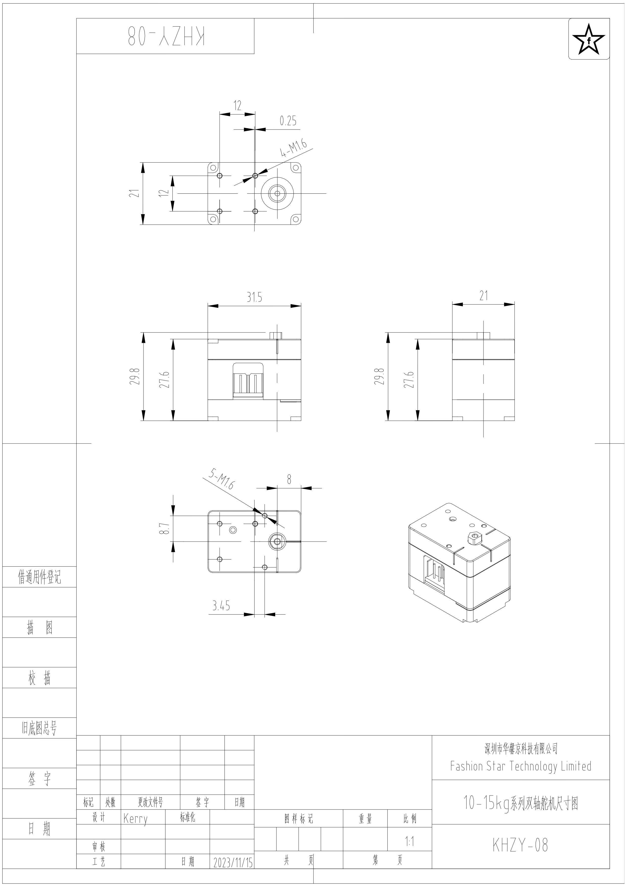

# RP6-U15 系列

---

### 尺寸预览

### 数据下载

<table>
  <thead>
    <tr>
      <th style="text-align: center;">兼容型号</th>
      <th style="text-align: center;">格式</th>
      <th style="text-align: center;">更新日期</th>
      <th style="text-align: center;">操作</th>
    </tr>
  </thead>
  <tbody>
    <tr>
      <td rowspan="3" class="no-wrap-cell" style="vertical-align: middle; background: var(--fs-bg-active); padding: 0 15px;">
        <ul style="margin: 0; padding: 0 0 0 1.2em; list-style-type: disc; font-size: 14.5px; line-height: 1.8;">
          <li><a href="https://wiki.fashionstar.com.hk/zh/uart-servo/specs/rp-rp6-u15h-m/"><strong>RP6-U15H-M</strong></a></li>
        </ul>
      </td>
      <td style="text-align: center;"><strong>.PDF</strong></td>
      <td style="text-align: center;">2025-09-26</td>
      <td style="text-align: center;"><a href="../data/rp6-u15/rp6-u15-dimension.pdf" download class="fs-download-btn">立即下载</a></td>
    </tr>
    <tr>
      <td style="text-align: center;"><strong>.STEP</strong></td>
      <td style="text-align: center;">2025-09-26</td>
      <td style="text-align: center;"><a href="../data/rp6-u15/rp6-u15-3D.STEP" download class="fs-download-btn">立即下载</a></td>
    </tr>
    <tr>
      <td style="text-align: center;"><strong>.DWG</strong></td>
      <td style="text-align: center;">2025-09-26</td>
      <td style="text-align: center;"><a href="../data/rp6-u15/rp6-u15-dimension.dwg" download class="fs-download-btn">立即下载</a></td>
    </tr>
  </tbody>
</table>



### 关联零配件图纸

<table>
  <thead>
    <tr>
      <th style="text-align: center;">4孔主舵盘</th>
      <th style="text-align: center;">格式</th>
      <th style="text-align: center;">更新日期</th>
      <th style="text-align: center;">操作</th>
    </tr>
  </thead>
  <tbody>
    <tr>
      <td rowspan="3" style="text-align: center; background: var(--fs-bg-active);">
        
      </td>
      <td style="text-align: center;"><strong>.PDF</strong></td>
      <td style="text-align: center;">2025-09-26</td>
      <td style="text-align: center;"><a href="../data/rp6-u15/hp6-rp6-main-horn-dimension.pdf" download class="fs-download-btn">立即下载</a></td>
    </tr>
    <tr>
      <td style="text-align: center;"><strong>.STEP</strong></td>
      <td style="text-align: center;">2025-09-26</td>
      <td style="text-align: center;"><a href="../data/rp6-u15/hp6-rp6-main-horn-3D.STEP" download class="fs-download-btn">立即下载</a></td>
    </tr>
    <tr>
      <td style="text-align: center;"><strong>.DWG</strong></td>
      <td style="text-align: center;">2025-09-26</td>
      <td style="text-align: center;"><a href="../data/rp6-u15/hp6-rp6-main-horn-dimension.dwg" download class="fs-download-btn">立即下载</a></td>
    </tr>
  </tbody>
</table>



<table>
  <thead>
    <tr>
      <th style="text-align: center;">4孔副舵盘</th>
      <th style="text-align: center;">格式</th>
      <th style="text-align: center;">更新日期</th>
      <th style="text-align: center;">操作</th>
    </tr>
  </thead>
  <tbody>
    <tr>
      <td rowspan="3" style="text-align: center; background: var(--fs-bg-active);">
        
      </td>
      <td style="text-align: center;"><strong>.PDF</strong></td>
      <td style="text-align: center;">2025-09-26</td>
      <td style="text-align: center;"><a href="../data/rp6-u15/rp6-u15-assistant-horn-dimension.pdf" download class="fs-download-btn">立即下载</a></td>
    </tr>
    <tr>
      <td style="text-align: center;"><strong>.STEP</strong></td>
      <td style="text-align: center;">2025-09-26</td>
      <td style="text-align: center;"><a href="../data/rp6-u15/rp6-u15-assistant-horn-3D.STEP" download class="fs-download-btn">立即下载</a></td>
    </tr>
    <tr>
      <td style="text-align: center;"><strong>.DWG</strong></td>
      <td style="text-align: center;">2025-09-26</td>
      <td style="text-align: center;"><a href="../data/rp6-u15/rp6-u15-assistant-horn-dimension.dwg" download class="fs-download-btn">立即下载</a></td>
    </tr>
  </tbody>
</table>



<table>
  <thead>
    <tr>
      <th style="text-align: center;">U型机身支架(31mm)</th>
      <th style="text-align: center;">格式</th>
      <th style="text-align: center;">更新日期</th>
      <th style="text-align: center;">操作</th>
    </tr>
  </thead>
  <tbody>
    <tr>
      <td rowspan="3" style="text-align: center; background: var(--fs-bg-active);">
        
      </td>
      <td style="text-align: center;"><strong>.PDF</strong></td>
      <td style="text-align: center;">2025-09-26</td>
      <td style="text-align: center;"><a href="../data/rp6-u15/rp6-u15-body-bracket-dimension.pdf" download class="fs-download-btn">立即下载</a></td>
    </tr>
    <tr>
      <td style="text-align: center;"><strong>.STEP</strong></td>
      <td style="text-align: center;">2025-09-26</td>
      <td style="text-align: center;"><a href="../data/rp6-u15/rp6-u15-body-bracket-3D.STEP" download class="fs-download-btn">立即下载</a></td>
    </tr>
    <tr>
      <td style="text-align: center;"><strong>.DWG</strong></td>
      <td style="text-align: center;">2025-09-26</td>
      <td style="text-align: center;"><a href="../data/rp6-u15/rp6-u15-body-bracket-dimension.dwg" download class="fs-download-btn">立即下载</a></td>
    </tr>
  </tbody>
</table>



<table>
  <thead>
    <tr>
      <th style="text-align: center;">U形舵盘支架(38mm)</th>
      <th style="text-align: center;">格式</th>
      <th style="text-align: center;">更新日期</th>
      <th style="text-align: center;">操作</th>
    </tr>
  </thead>
  <tbody>
    <tr>
      <td rowspan="3" style="text-align: center; background: var(--fs-bg-active);">
        
      </td>
      <td style="text-align: center;"><strong>.PDF</strong></td>
      <td style="text-align: center;">2025-09-26</td>
      <td style="text-align: center;"><a href="../data/rp6-u15/rp6-u15-horn-bracket-dimension.pdf" download class="fs-download-btn">立即下载</a></td>
    </tr>
    <tr>
      <td style="text-align: center;"><strong>.STEP</strong></td>
      <td style="text-align: center;">2025-09-26</td>
      <td style="text-align: center;"><a href="../data/rp6-u15/rp6-u15-horn-bracket-3D.STEP" download class="fs-download-btn">立即下载</a></td>
    </tr>
    <tr>
      <td style="text-align: center;"><strong>.DWG</strong></td>
      <td style="text-align: center;">2025-09-26</td>
      <td style="text-align: center;"><a href="../data/rp6-u15/rp6-u15-horn-bracket-dimension.dwg" download class="fs-download-btn">立即下载</a></td>
    </tr>
  </tbody>
</table>




