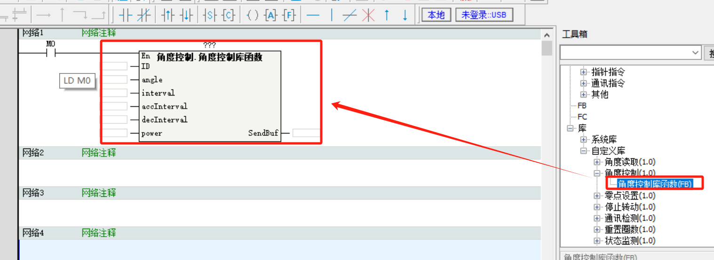

# **汇川AutoShop平台使用说明（例程PLC：H5U）**

## 一、接线说明

### 1.机柜接线说明

### 2.PLC-UC04-UART舵机接线说明

| **RS485+** | **UC04_B** |
| ---------- | ---------- |
| **RS485-** | **UC04_A** |

### 3.RS485舵机接线说明

| **PLC-A**                  | **RS485舵机-A** |
| -------------------------- | --------------- |
| **PLC-B**                  | **RS485舵机-B** |
| **电源+**                  | **RS485舵机+**  |
| **电源-（需要和PLC共地）** | **RS485舵机-**  |

## 二、程序说明

### **1.组态配置（软件为：AutoShop）**

①点击COM0口配置通讯参数

②协议选择：自由协议

③通讯速率：115200

​	数据长度：8位

​	奇偶校验：无

​	停止位：1位

### **2.FB库使用**

①在‘’AutoShop‘’软件的工具箱中右键自定义库，导入全部FB库

②双击需要的FB库，将FB库调用到网络中

③填入参数

**FB库指令参数：**

- ID：舵机ID号
- angle：舵机运行到的角度，单位0.1°(例如90度需要填入900)
- interval：舵机到达角度需要的时间，单位ms
- accInterva：加速时间，单位ms
- decInterval：减速时间，单位ms
- power：舵机执行功率,单位mw
- SendBuf：指令存入寄存器位置（INT类型)

③存入完毕后用SerialSR指令将指令通过端口0发送

- Port：端口号

- SendBuf：发送数据区（MOV指令存入的第一个寄存器）

- SendSize：发送字节数，0-256

- RcvBuf：接收缓冲区

- RcvBuf：接收字节数，0-256

- Timeout：接收超时时间，20-30000，单位 ms*

- Done：完成标志*

- Status：指令运行状态*

- Sent：已发送数据大小*

- Receiced：已接收数据大小

  注:*:允许不设置指令参数，若未设置，使用默认值或无输出
